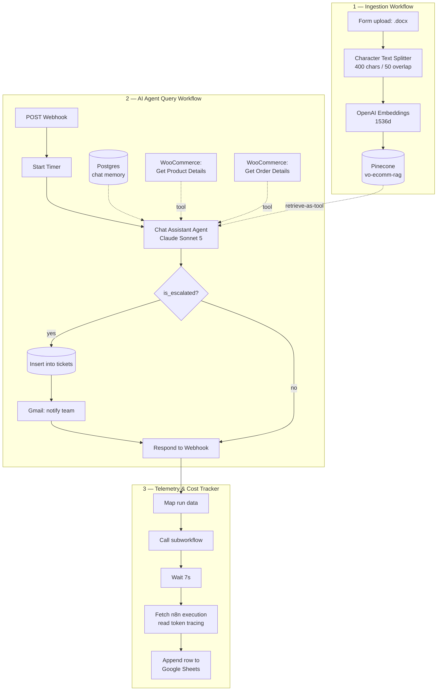

# ViltrumOne — WooCommerce RAG Support Agent
 
An AI customer-support agent for a WordPress/WooCommerce storefront, built as three n8n workflows. It answers customer questions from a Pinecone-backed knowledge base, pulls live product and order data from WooCommerce, escalates instead of hallucinating, and logs latency plus token cost for every run.
 
Built for [ViltrumOne](https://jlmng.cloud), a headless WooCommerce demo store.
 

 
---
 
## Table of contents
 
- [What it does](#what-it-does)
- [Stack](#stack)
- [Architecture](#architecture)
- [The three workflows](#the-three-workflows)
- [Setup](#setup)
- [Frontend integration](#frontend-integration)
- [Guardrails](#guardrails)
- [Known issues & roadmap](#known-issues--roadmap)
- [License](#license)
---
 
## What it does
 
| Capability | How |
| --- | --- |
| **RAG** | Store docs (policies, FAQs, shipping info) are chunked, embedded, and retrieved from a Pinecone index on every query. |
| **Live tool calling** | Read-only WooCommerce tools for real-time product listings and order lookup by order ID. |
| **Conversation memory** | Postgres-backed chat memory keyed by `sessionId`. |
| **Escalation** | When the agent can't answer confidently, it flags `is_escalated`, writes a row to a `tickets` table, and emails the internal team — instead of guessing. |
| **Telemetry & cost** | Every run logs session, question, answer, latency, input/output tokens, and computed USD cost to Google Sheets. |
 
---
 
## Stack
 
- **Orchestration:** n8n (LangChain nodes)
- **LLM:** Claude Sonnet 5 (Anthropic)
- **Embeddings:** OpenAI, 1536 dimensions
- **Vector DB:** Pinecone — index `vo-ecomm-rag`
- **Memory + tickets:** Postgres
- **Commerce:** WooCommerce REST API
- **Notifications:** Gmail
- **Observability sink:** Google Sheets (`Agent Runs`)
---
 
## Architecture
 

 
---
 
## The three workflows
 
### 1. `ViltrumOne - Ingestion Workflow.json`
 
A form trigger that accepts a `.docx` knowledge-base file, splits it into 400-character chunks with 50-character overlap, embeds it with OpenAI, and upserts into the `vo-ecomm-rag` Pinecone index.
 
Run this any time store policies, FAQs, or shipping terms change.
 
### 2. `ViltrumOne - AI Agent Query Workflow.json`
 
The runtime path. A `POST` webhook (CORS-locked to the store origin) receives a message, starts a latency timer, and hands it to the agent.
 
**Request body:**
 
```json
{
  "sessionId": "6a1acd4f-5720-4d50-9c15-459495d53984",
  "message": "Where is my order 1042?",
  "timestamp": "2026-09-09T09:08:28.678Z"
}
```
 
**Response:**
 
```json
{ "reply": "Order 1042 shipped on Sept 7 and is out for delivery." }
```
 
The agent is wired to four things: the Pinecone retriever, Postgres chat memory, and two read-only WooCommerce tools. Its output is forced through a structured parser:
 
```json
{
  "output": "the customer-facing reply",
  "escalate_object": {
    "is_escalated": false,
    "reason": "why it was escalated"
  }
}
```
 
If `is_escalated` is true, an IF node branches to a Postgres insert on `tickets` and a Gmail notification before responding.
 
**`tickets` table:**
 
| Column | Type |
| --- | --- |
| `id` | PK |
| `created_at` | timestamptz |
| `session_id` | text |
| `question` | text |
| `reason` | text |
| `status` | text (`open`) |
| `resolved_at` | timestamptz, nullable |
 
### 3. `ViltrumeOne - Agent Telemetry and Cost Tracker Workflow.json`
 
A subworkflow called at the end of every query. It waits 7 seconds for the parent execution to finalize, fetches that execution via the n8n API, reads `llm.tokens.in` / `llm.tokens.out` from the agent node's tracing metadata, computes cost, and appends a row to the `Agent Runs` sheet.
 
Cost formula (currently hardcoded to Sonnet 5 rates):
 
```
cost_usd = (token_in / 1_000_000 * 2) + (token_out / 1_000_000 * 10)
```
 
Sheet columns: `timestamp`, `session_id`, `question`, `answer`, `sources`, `tokens`, `escalated`, `latency_ms`, `cost_usd`.
 
---
 
## Setup
 
### Prerequisites
 
- A running n8n instance (self-hosted or cloud) reachable by your storefront
- Postgres database
- Pinecone index, 1536 dimensions, cosine
- WooCommerce store with REST API keys (read scope is enough)
- API keys: Anthropic, OpenAI
- Google account for Sheets + Gmail
### Steps
 
1. **Import the workflows.** In n8n: *Workflows → Import from File*, once per JSON.
2. **Create credentials** and reattach them to each node (credentials are not included in the exports):
   | Credential | Used by |
   | --- | --- |
   | Anthropic API | `Sonnet 5` |
   | OpenAI API | both `Embeddings OpenAI` nodes |
   | Pinecone API | both vector store nodes |
   | Postgres | `Chat memory`, `Issue New Ticket` |
   | WooCommerce API | `Get Product Details`, `Get order details` |
   | Gmail OAuth2 | `Notify Internal Team` |
   | Google Sheets OAuth2 | `Append row in sheet` |
   | n8n API | `Get an execution` |
3. **Create the `tickets` table:**
```sql
   CREATE TABLE tickets (
     id          BIGSERIAL PRIMARY KEY,
     created_at  TIMESTAMPTZ NOT NULL DEFAULT now(),
     session_id  TEXT NOT NULL,
     question    TEXT NOT NULL,
     reason      TEXT,
     status      TEXT NOT NULL DEFAULT 'open',
     resolved_at TIMESTAMPTZ
   );
```
 
   The Postgres chat memory node creates its own table automatically on first run.
 
4. **Create the Google Sheet** named `Agent Runs` with the columns listed above, then point the `Append row in sheet` node at it.
5. **Update the environment-specific values:**
   - Webhook node → `Allowed Origins`: your storefront domain
   - Gmail node → `Send To`: your support inbox
   - Query workflow → `Call 'Agent Telemetry...'`: reselect the subworkflow so the ID resolves in your instance
6. **Seed the knowledge base.** Activate the ingestion workflow, open its form URL, upload your policy/FAQ `.docx`.
7. **Activate** the query workflow and copy the production webhook URL.
---
 
## Frontend integration
 
Any chat widget that can POST JSON works. Minimal example:
 
```js
const sessionId =
  sessionStorage.getItem("vo_session") ?? crypto.randomUUID();
sessionStorage.setItem("vo_session", sessionId);
 
async function ask(message) {
  const res = await fetch(N8N_WEBHOOK_URL, {
    method: "POST",
    headers: { "Content-Type": "application/json" },
    body: JSON.stringify({
      sessionId,
      message,
      timestamp: new Date().toISOString(),
    }),
  });
  const { reply } = await res.json();
  return reply;
}
```
 
The system prompt instructs the agent to return **plain text, not markdown**, because the widget in use doesn't render markdown. Remove that instruction if your widget does.
 
---
 
## Guardrails
 
Enforced through the system prompt and the structured output schema:
 
- **Retrieval is mandatory** — the agent must consult the knowledge base on every query.
- **No invention** — policies, prices, and order details are never made up; unanswerable questions escalate.
- **Live data over stale docs** — product questions go to the WooCommerce tool, not the embedded documents.
- **Scope limiting** — off-topic or prompt-injection-style requests get a short refusal instead of autonomous action.
- **Read-only tools** — WooCommerce access is `get` / `getAll` only. The agent cannot mutate store data.
- **Order ID required** — no order lookup without a customer-supplied order number.
- **Never breaks character** — no "I searched the knowledge base" narration.
---
 
## Known issues & roadmap
 
- [ ] `Get an execution` has a hardcoded execution ID (`195`) — should reference `{{ $json.execId }}` from the subworkflow input.
- [ ] Token pricing is hardcoded to Sonnet 5 rates. Add a `model` column and branch pricing per model.
- [ ] Sheet columns `sources`, `tokens`, and `escalated` are still placeholder strings.
- [ ] The ticket insert writes the agent's output into the `question` column instead of the customer's original message.
- [ ] The 7-second `Wait` before reading execution metadata is fragile under load — consider polling with retry.
- [ ] Ingestion only accepts `.docx`; add PDF and URL loaders.
- [ ] No re-ingestion / dedupe strategy — re-uploading a document creates duplicate vectors.
---
 
## License

MIT — see [LICENSE](LICENSE).
